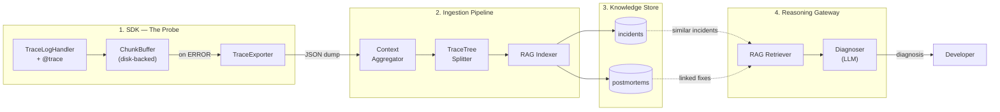
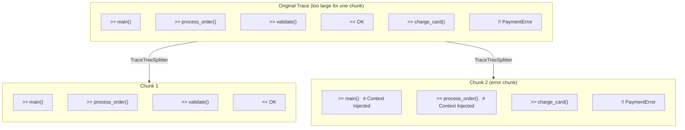
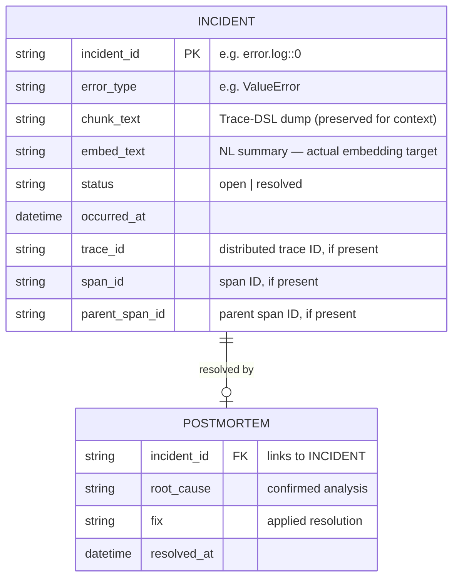

# TraceLog

> **LLM-native logging for Python.**
> Capture execution flow as structured Trace-DSL. Diagnose errors from past incidents using RAG.

TraceLog is a Python logging SDK that captures the complete execution narrative leading to an error and serializes it as **Trace-DSL** — a compact, indentation-based format optimized for LLM context windows. Historical incidents are indexed in a vector database, and when a new error occurs, semantically similar past incidents (along with their confirmed fixes) are retrieved automatically to assist diagnosis.

---

## The Problem We're Exploring

When an LLM is asked to diagnose a production error, the quality of its answer depends heavily on what it is given to read. We think there are three structural issues with the information that standard logging and stack traces provide.

**Causality has to be reconstructed.** Standard logs are a time-ordered stream of lines. To understand why an error occurred, the LLM has to correlate timestamps, match function names across lines, and mentally re-assemble the call chain — work that consumes tokens and iterations before any actual diagnosis begins. A stack trace gives you the moment of failure but not the journey that led there: which arguments were passed, what intermediate values looked like, which path through the code was taken.

**Concurrent execution interleaves context.** In multi-threaded or async code, log lines from different execution flows are written in arrival order. The LLM has to parse thread-name tags and untangle the interleaving before it can reason about any single flow. The more concurrency, the more this dominates the context window.

**The distance between symptom and cause is invisible.** An error surfaces in one function but originates in another. Standard logs show where it exploded; they don't necessarily show the upstream decision that caused it.

Our hypothesis is that if the execution context is already structured — causality encoded in indentation, concurrent flows separated by span IDs, argument values captured at the call site — the LLM can direct its reasoning toward the actual cause rather than spending it on reconstruction. Whether that hypothesis holds, and under what conditions, is what this project is trying to measure.

---

## What does Trace-DSL look like?

```text
>> pay(user_id=101, amount=5000)
  .. [INFO] Payment attempt: user_id=101, amount=5000
  >> get_balance(user_id=101)
    .. [DEBUG] Querying balance from DB: user_id=101
    << 3000
  .. [ERROR] Insufficient funds (balance=3000, requested=5000)
!! ValueError: InsufficientFunds: balance=3000, amount=5000
```

| Symbol | Meaning | Example |
|--------|---------|---------|
| `>>` | Function entry (via `@trace`) | `>> pay(user_id=101, amount=5000)` |
| `<<` | Function return | `<< 3000` |
| `!!` | Exception or ERROR log | `!! ValueError: InsufficientFunds` |
| `.. [LEVEL]` | Standard log message | `.. [INFO] Payment attempt` |

Indentation = **2 spaces x call depth**. A single dump captures the complete call tree, argument values, and error propagation path — no interleaving, no ambiguity.

---

## Project Status

> [!WARNING]
> TraceLog is an **experimental research project (v0.1)**. It is not production-ready. APIs may change. Benchmarks are preliminary and run on a small scenario set.

**Included in MVP:**

- SDK integration via standard `logging.Handler` + optional `@trace` decorator
- CLI for indexing, diagnosis, and postmortem management
- TraceTree chunking (call-tree-aware splitting for embeddings)
- Qdrant-backed vector store with dual-collection incident/postmortem model
- RAG retriever + LLM diagnoser with linked fix retrieval

**Not yet included:**

- Production hardening and performance optimization
- Async-native instrumentation
- Multi-service distributed tracing
- Hosted service or SaaS offering

---

## Quick Start

### Install

```bash
git clone https://github.com/jakeeqsb/tracelog.git
cd tracelog
uv pip install -e .
```

### SDK Integration

```python
import logging
from tracelog import TraceLogHandler, trace

# One line added to existing logging setup
logging.getLogger().addHandler(TraceLogHandler(capacity=200))

@trace  # Optional: adds >> / << / !! with argument capture
def process_order(order_id: int) -> None:
    logging.info(f"Processing order {order_id}")
    # ... your existing code ...
```

When an `ERROR` log is emitted, the handler automatically flushes all buffered context as a Trace-DSL dump.

### CLI

```bash
# Index trace dumps into the vector store
tracelog index <dump_dir>

# RAG-based diagnosis of a new error
tracelog diagnose <dump_file> [--top-k 5]

# Record how an incident was resolved
tracelog postmortem commit --incident-id <id> --root-cause "..." --fix "..."

# Search past fixes by semantic similarity
tracelog postmortem search --query "string conversion failure" [--top-k 5]
```

---

## RAG Investigation Agent

`TraceLogAgent` is a conversational agent that accepts natural-language questions about past incidents and synthesizes answers from the vector store. It sits above the retriever and diagnoser layers, orchestrating multi-step retrieval through a LangChain `create_agent` loop before producing a structured response.

### How it works

```text
User question (natural language)
        │
        ▼
  TraceLogAgent.ask()
        │
        ▼
  create_agent loop  ──────────────────────────────┐
        │                                          │
        │  search_incidents(query, error_type,      │
        │                   date_from, date_to)     │
        │  search_fixes(query)                      │
        │  fetch_incident(incident_id)              │
        │                                          │
        ▼                                          │
  Last agent message ◄────────────────────────────┘
        │
        ▼
  with_structured_output(AgentAnswer)
        │
        ▼
  AgentAnswer
    ├── answer           (natural-language summary)
    ├── incidents[]      (IncidentSummary per referenced incident)
    │     ├── incident_id, error_type, occurred_at, status
    │     ├── score      (vector similarity, 0.0–1.0)
    │     ├── summary    (1–2 sentence description)
    │     ├── error_trace (3–5 key Trace-DSL lines around !!)
    │     ├── trace_id / span_id
    │     └── root_cause / fix  (postmortem data, resolved incidents only)
    ├── confidence       ("high" | "medium" | "low")
    └── sources_used     (list of tool names called)
```

**Three retrieval tools** are available to the agent during its reasoning loop:

| Tool | Purpose |
| ---- | ------- |
| `search_incidents` | Semantic search across indexed incident chunks. Accepts `error_type`, `date_from`, `date_to` filters. |
| `search_fixes` | Semantic search directly on the postmortem collection — finds similar past fixes without an incident lookup. |
| `fetch_incident` | Fetches full Trace-DSL context for a specific incident by ID. Reconstructs multi-chunk traces and links postmortem if present. |

### Usage

```python
from tracelog.rag import TraceLogAgent, TraceLogRetriever
from tracelog.rag.stores.qdrant import QdrantStore

incident_store   = QdrantStore(collection_name="tracelog_incidents")
postmortem_store = QdrantStore(collection_name="tracelog_postmortems")
retriever = TraceLogRetriever(store=incident_store, postmortem_store=postmortem_store)

agent = TraceLogAgent(retriever=retriever)
answer = agent.ask("What DB connection incidents happened last week?")

print(answer.answer)
for inc in answer.incidents:
    print(inc.incident_id, inc.status, f"score={inc.score:.4f}")
    if inc.error_trace:
        print(inc.error_trace)
    if inc.root_cause:
        print(f"root_cause: {inc.root_cause}")
        print(f"fix:        {inc.fix}")
```

Or interactively via the REPL:

```bash
python scripts/rag_repl.py
> agent What DB connection issues have there been? Include resolved ones and how they were fixed.
```

### Example output

```text
[high confidence]

DB connection incidents:

1. ConnectionError_inventory_db.log (resolved, score=0.3160)
   error_trace:
     >> reserve_stock(item_id='SKU-42', qty=5)
       >> acquire_db_connection(pool='inventory')
         >> connect_to_replica(host='replica-2')
           !! ConnectionError: [Errno 111] Connection refused
   root_cause: Replica node replica-2 was removed from the pool during
               a rolling restart but the pool config was not updated.
   fix: Updated connection pool config to exclude replica-2 and added
        health-check before acquiring connections.

2. ConnectionError_inventory_cache.log (open, score=0.2220)
   error_trace:
     >> get_cached_stock(item_id='SKU-42')
       >> redis_get(key='stock:SKU-42')
         !! ConnectionError: Redis connection timeout after 5000ms
```

### Environment variable

| Variable | Default |
| -------- | ------- |
| `TRACELOG_AGENT_MODEL` | `gpt-4o` |

---

## Architecture

TraceLog consists of four layers: the **SDK probe**, the **ingestion pipeline**, the **knowledge store**, and the **reasoning gateway**.



| Layer | Components | Key Files |
|-------|-----------|-----------|
| **SDK** | TraceLogHandler, @trace, ChunkBuffer, Exporter | `tracelog/handler.py`, `instrument.py`, `buffer.py`, `exporter.py` |
| **Ingestion** | ContextAggregator, TraceTreeSplitter, RAGIndexer | `tracelog/ingestion/aggregator.py`, `tracelog/chunking/splitter.py`, `tracelog/rag/indexer.py` |
| **Storage** | VectorStore Protocol, QdrantStore | `tracelog/rag/store.py`, `tracelog/rag/stores/qdrant.py` |
| **Reasoning** | Retriever, Diagnoser | `tracelog/rag/retriever.py`, `tracelog/rag/diagnoser.py` |

For the full architecture deep dive, see [docs/system_architecture.md](docs/system_architecture.md).

### Execution Context: trace_id, span_id, parent_span_id

Each dump emitted by the SDK carries three identifiers that the `ContextAggregator` uses to reconstruct the original execution tree.

| ID | Scope | Role |
|----|-------|------|
| `trace_id` | One logical execution flow (e.g. a single request or job) | Groups all related dumps together |
| `span_id` | One execution unit within that flow (e.g. one thread or coroutine) | Identifies "who produced this dump" |
| `parent_span_id` | The span that spawned this unit | Links child spans back to their caller |

These IDs are managed automatically via `contextvars.ContextVar`, which provides isolation across threads and asyncio tasks without manual propagation.

**Why this matters in concurrent code.** When `process_order()` delegates work to a thread pool, each worker emits its own dump — the execution context is fragmented. The aggregator uses `parent_span_id` to link each worker dump back to its caller and render them as a single coherent tree.

```text
# dump 1  (main thread)
trace_id=abc  span_id=s1  parent_span_id=None
>> process_order(order_id=42)
  .. [INFO] delegating to workers

# dump 2  (worker thread A)
trace_id=abc  span_id=s2  parent_span_id=s1
  >> validate_stock(item="SKU-9")
    << ok

# dump 3  (worker thread B)
trace_id=abc  span_id=s3  parent_span_id=s1
  >> charge_card(amount=9900)
    !! PaymentError: card declined
```

```text
# ContextAggregator output — one unified trace
=== [TraceLog] Unified Trace (trace_id: abc) ===
>> process_order(order_id=42)
  .. [INFO] delegating to workers
  >> validate_stock(item="SKU-9")
    << ok
  >> charge_card(amount=9900)
    !! PaymentError: card declined
```

Without the span relationship, the two worker dumps would be treated as separate, unrelated incidents.

---

## Chunking Strategy: TraceTree Splitting

Standard recursive text splitters operate on arbitrary character boundaries, which can separate an error line from the parent call frames that give it meaning. **TraceTreeSplitter** splits at logical function-entry boundaries (`>>`) and injects parent call-stack context into downstream chunks to keep the error's ancestry intact.

### Two-pass algorithm

1. **Pass 1** scans the entire trace to identify error lines (`!!`) and snapshots the active call stack leading to each error.
2. **Pass 2** splits at tree boundaries using tiered thresholds, injecting the parent call-stack context (marked `# [TraceTree] Context Injected`) into new chunks so the error's ancestry is never lost.

**Tiered break thresholds** — relaxed as chunks grow to prevent unbounded growth in deeply nested traces:

| Chunk fullness | Split allowed at |
|----------------|-----------------|
| < 1.0x `chunk_size` | No split |
| 1.0x – 1.5x | `>>` at indent ≤ 2 (top-level calls only) |
| 1.5x – 2.0x | `>>` at indent ≤ 4 |
| ≥ 2.0x | Any `>>` (hard cap) |

### Visual: Context injection across chunk boundaries



### Embedding quality

| Chunking Method | Silhouette Score (OpenAI) | Change |
|----------------|--------------------------|--------|
| Recursive text splitting | 0.39 | — |
| **TraceTree splitting** | **0.66** | **+69%** |

Higher Silhouette Score = better clustering quality for embeddings, meaning similar errors are grouped more tightly in the vector space and retrieval accuracy improves.

---

## Incident & Postmortem Data Model

TraceLog uses two vector collections — **incidents** and **postmortems** — linked by `incident_id`. This dual-collection design separates machine-generated execution context from human-authored resolution knowledge, because Trace-DSL and natural-language fix descriptions occupy different semantic spaces.



### Lifecycle

1. **Error occurs** — SDK dumps Trace-DSL → Indexer creates an `INCIDENT` node (status: `open`)
2. **Engineer investigates** — runs `tracelog diagnose` → Retriever finds similar past incidents + any linked postmortems
3. **Fix confirmed** — runs `tracelog postmortem commit` → `POSTMORTEM` node created, `INCIDENT` status flipped to `resolved`
4. **Next similar error** — Retriever finds the matching `INCIDENT`, loads the linked `POSTMORTEM` → LLM receives past root cause and fix as context

### Vector search paths

- **Incident retrieval**: embed natural-language query → cosine search on `embed_text` vectors in `tracelog_incidents` → return similar execution patterns
- **Linked fix lookup**: extract `incident_id` from matched incidents → payload filter on `tracelog_postmortems` → attach root cause + fix
- **Independent fix search**: embed a natural-language query → cosine search directly on `tracelog_postmortems` → find semantically similar past fixes

---

## How Is This Different from Jira?

| Dimension | Jira | TraceLog |
|-----------|------|----------|
| **Content source** | Human-authored ticket descriptions | Machine-generated execution traces |
| **What it captures** | "What someone reported happened" | "Exactly what the code executed" |
| **Search method** | Keyword / JQL text matching | Semantic vector similarity on execution structure |
| **Triage** | Manual assignment and categorization | Automated retrieval of similar past incidents + fixes |
| **Resolution knowledge** | Comments and linked documents | Structured postmortems with `root_cause` and `fix` fields, embedded for vector search |

TraceLog is **not a replacement for Jira**. The two address different layers: Jira tracks the human workflow around an incident; TraceLog indexes the machine-level execution context. Whether that context adds value depends on the nature of the bugs and the team's workflow.

---

## Benchmark Results (v3 — latest)

> Results are from a small evaluation set and should be read as directional, not as general claims.

**v3** extends the benchmark along two axes: **3 providers** (OpenAI `gpt-4o`, Google `gemini-2.5-pro`, Anthropic `claude-opus-4-6`) and **7 scenarios** (4 reused from v2 + 3 new multi-threading scenarios).

### Summary (7 scenarios × 3 providers × 2 conditions = 42 runs)

| Provider | Fix Rate A → B | Token Reduction | Latency Reduction |
| --- | --- | --- | --- |
| **OpenAI gpt-4o** | 71% → **100%** | **−64%** (39k → 14k avg) | **−61%** (58s → 23s) |
| **Google gemini-2.5-pro** | 100% → 100% | −12% | −8% |
| **Anthropic claude-opus-4-6** | 100% → 100% | −16% | −15% |

**Multi-threading scenarios** (v3 new) showed a larger token reduction than single-process scenarios (−40% vs −30%), confirming that TraceLog's span-based concurrent log separation is most valuable when standard logs interleave worker output.

Most striking case: `producer_aggregator × OpenAI` — Standard Log consumed **107k tokens** (agent looped 6+ times), TraceLog resolved it in **13k tokens** (−88%).

Full results: [docs/eval/benchmark_v3/benchmark_v3_results.ipynb](docs/eval/benchmark_v3/benchmark_v3_results.ipynb)

---

## Benchmark Results (v2)

> Included for historical reference. v3 supersedes these results with multi-provider evaluation.

### How the benchmark works

The benchmark compares two conditions across identical scenarios:

- **Condition A** — agent receives a standard `logging` output
- **Condition B** — agent receives a unified Trace-DSL output (assembled by `ContextAggregator`)

Each run follows this pipeline:

```text
1. Bug Writer LLM        generates a Python scenario with a hidden bug
                         and a sealed_truth.json (root cause, expected fix)

2. Execution             the same scenario is run twice in subprocess isolation:
                         once with standard logging, once with TraceLogHandler
                         → produces standard.log and tracelog.log

3. Comment stripping     all # comments are removed from the scenario source
                         before the agents see it (prevents trivial hint leakage)

4. Diagnosis Agent (A)   receives standard.log + comment-stripped scenario_A.py
   Diagnosis Agent (B)   receives tracelog.log + comment-stripped scenario_B.py

                         Each agent is a LangChain create_agent loop (gpt-4o)
                         with three tools:
                           read_file   — read source lines
                           search_code — grep-style search in the codebase
                           write_file  — overwrite scenario and immediately run it
                                         returns PASS or FAIL:<exception>

5. Fix verification      after the agent loop ends, the scenario file on disk
                         is executed; fix_success = True if it no longer raises

6. Judge LLM             independently reads the agent's message history and
                         the sealed_truth to assess whether the root cause
                         was correctly identified (root_cause_identified)

7. Metrics extraction    collected post-run from the LangChain message list:
                         tool_call_count, fix_attempts, iterations, total_tokens, latency
```

The agents are given no information about which condition they are in — they only see the log text and the code file.

### Results (4 hand-crafted scenarios)

Each scenario was designed to represent a structurally distinct class of bug. Both agents received identical source code with comments stripped.

| Scenario | Bug type | Standard Log (A) | Trace-DSL (B) |
|----------|----------|-----------------|---------------|
| **API Gateway** | Dict key typo propagates as `None` through call chain | Success — 14,863 tokens, 7 iterations | Success — **4,842 tokens, 3 iterations** |
| **Maze** | `float` division where `int` floor division is required, causes `TypeError` two levels up | **Failed** — 24,833 tokens, 9 iterations | Success — **4,699 tokens, 3 iterations** |
| **Dynamic Pricing** | Timestamp offset produces a future date that is missing from a price snapshot dict | Success — 10,754 tokens, 4 iterations | Success — **6,174 tokens, 3 iterations** |
| **Thread Local** | `threading.local()` not reset between reused worker threads leaks admin state | **Failed** — 38,563 tokens, 10 iterations | Success — **14,001 tokens, 9 iterations** |

The two conditions produced different outcomes on scenarios where the root cause was structurally distant from the surface error — a key overnaming in a config registry (API Gateway), a type error surfacing two frames above where the wrong operator was used (Maze), and a state leak across thread reuse that is invisible in a flat log (Thread Local).

On scenarios where the symptom and cause were closer together, token usage was the main difference rather than fix success.

Full results: [docs/eval/benchmark_v2/runs/](docs/eval/benchmark_v2/runs/) | Methodology: [docs/eval/benchmark_v2_langchain.md](docs/eval/benchmark_v2_langchain.md)

---

## Development

### Prerequisites

- Python >= 3.12
- [uv](https://docs.astral.sh/uv/) (recommended) or pip

### Setup

```bash
uv sync
```

### Running tests

```bash
uv run pytest tests/
```

### Environment variables

RAG features require the following in a `.env` file:

| Variable | Required | Default |
|----------|----------|---------|
| `OPENAI_API_KEY` | Yes (for RAG) | — |
| `QDRANT_URL` | No | In-memory mode |
| `TRACELOG_INCIDENTS_COLLECTION` | No | `tracelog_incidents` |
| `TRACELOG_POSTMORTEMS_COLLECTION` | No | `tracelog_postmortems` |
| `OPENAI_EMBEDDING_MODEL` | No | `text-embedding-3-small` |
| `TRACELOG_DIAGNOSER_MODEL` | No | `gpt-4o-mini` |

---

## Documentation

- [System Architecture](docs/system_architecture.md) — full pipeline deep dive
- [SDK Overview](docs/sdk/overview.md) — handler, buffer, exporter, @trace design
- [RAG Store Design](docs/rag/store.md) — VectorStore protocol and Qdrant adapter
- [Postmortem Design](docs/rag/postmortem.md) — incident/postmortem ingestion and retrieval
- [Benchmark Methodology](docs/eval/benchmark_v2_langchain.md) — evaluation pipeline design
- [examples/](examples/) — runnable integration demos
