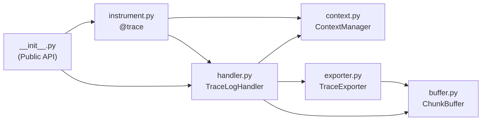

# TraceLog SDK — Component Design Overview

TraceLog SDK is a lightweight tracing layer built on top of the Python standard `logging` infrastructure. It generates an execution context in Trace-DSL format, which is optimized for LLM readability, without requiring any modifications to your application code.

---

## Design Principles

| Principle | Meaning |
|---|---|
| **Zero-Friction Integration** | `addHandler(TraceLogHandler())` is the single mandatory integration step. Everything else is optional. |
| **AI-First Context** | All output formats are designed to provide maximum context with minimal tokens for LLMs to understand. |
| **Selective Persistence** | During normal execution, logs are accumulated only in the in-memory buffer. They are dumped to disk exclusively when an ERROR occurs, resulting in zero passive storage overhead. |

---

## Component Dependency Map

```
tracelog/
├── __init__.py          ← Public API entry point (TraceLogHandler, trace, get_buffer)
│
├── handler.py           ← [Primary] TraceLogHandler + get_buffer()
│   ├── depends on → buffer.py (ChunkBuffer)
│   ├── depends on → context.py (ContextManager)
│   └── depends on → exporter.py (TraceExporter)
│
├── instrument.py        ← [Optional] @trace decorator
│   ├── depends on → handler.py (get_buffer)
│   └── depends on → context.py (ContextManager)
│
├── buffer.py            ← [Foundation] ChunkBuffer + LogEntry
│   └── no internal dependencies
│
├── context.py           ← [Foundation] ContextManager
│   └── no internal dependencies
│
└── exporter.py          ← [Integration] TraceExporter, StreamExporter, FileExporter
    └── depends on → buffer.py (LogEntry)
```



---

## Component Summary

| Module | Core Class/Function | Role | Design Document |
|---|---|---|---|
| `buffer.py` | `LogEntry`, `ChunkBuffer` | In-memory storage for Trace-DSL entries | [buffer.md](./buffer.md) |
| `context.py` | `ContextManager` | Manages per-context Trace ID and Call Depth | [context.md](./context.md) |
| `exporter.py` | `TraceExporter` etc. | Pluggable DSL dump destinations | [exporter.md](./exporter.md) |
| `handler.py` | `TraceLogHandler`, `get_buffer()` | Integration entry point and buffer accessor | [handler.md](./handler.md) |
| `instrument.py` | `trace` (decorator) | Function-level detailed tracing (opt-in) | [instrument.md](./instrument.md) |

---

## Trace-DSL Symbol System

All outputs generated by TraceLog adhere to the symbol system below. **Modifications to this format are only possible through an official Request for Comments (RFC).**

| Symbol | Trigger Condition | Example |
|---|---|---|
| `>>` | Entering an `@trace` function | `>> pay(user_id=1, amount=5000)` |
| `<<` | Normal return from an `@trace` function | `<< 3000` |
| `!!` | ERROR log or `@trace` exception | `!! ValueError: InsufficientFunds` |
| `.. [LEVEL]` | INFO / DEBUG log | `.. [INFO] Payment started` |
| `..` | WARNING log | `.. Retrying connection` |

Indentation follows a **2 spaces × depth** rule based on the call depth managed by the `ContextManager`.

---

## Execution Flow Summary

```
[App Code]                    [TraceLog SDK]
   │
   ├─ logger.info("A")  ──►  TraceLogHandler.emit()
   │                              └─ _to_dsl() → ".. [INFO] A"
   │                              └─ get_buffer().push(...)
   │
   ├─ Enter @trace fn   ──►  instrument.trace.wrapper()
   │                              └─ get_buffer().push(">> func(...)")
   │                              └─ ContextManager.increase_depth()
   │
   ├─ logger.error("X") ──►  TraceLogHandler.emit()
   │                              └─ _to_dsl() → "!! X"
   │                              └─ get_buffer().push(...)
   │                              └─ _dump() ← ERROR triggers this
   │                                   └─ buf.flash() → entries[]
   │                                   └─ exporter.export(entries)
   │
   └─ [Buffer cleared, ready for next execution]
```
