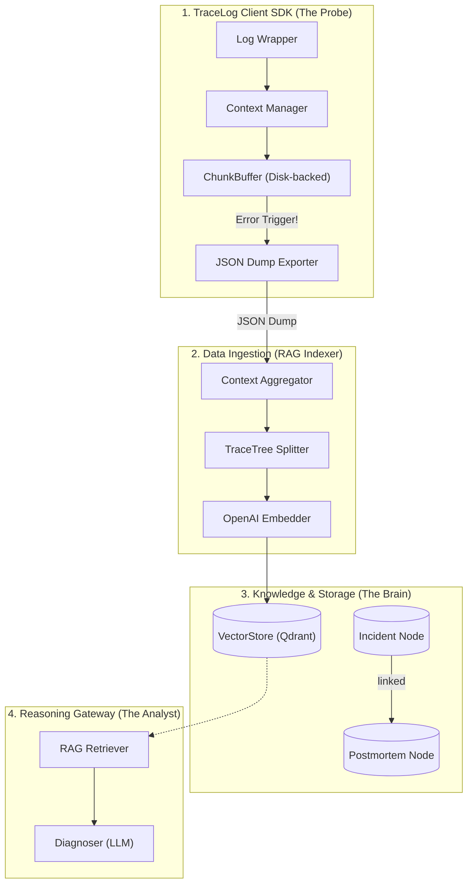
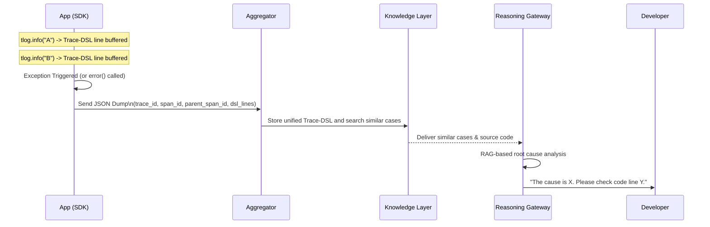

# TraceLog System Architecture

TraceLog is an intelligent log analysis system that tracks the entire execution trajectory of an application, but only dumps and analyzes the full context at significant moments (e.g., when an error occurs).

## System Overview

The entire system consists of four core layers.

## Layer Details

### 1. TraceLog Client SDK (The Probe)

A lightweight agent residing within the user application that monitors the execution flow.

| Component | Function & Role |
| --- | --- |
| **[TraceLogHandler](sdk/handler.md)** | Inherits from `logging.Handler`. Intercepts all log records by implementing `emit()`. Thread Locking is delegated to the parent class. Developers can integrate this with a single line: `addHandler()`. |
| **[ChunkBuffer](sdk/buffer.md)** | Thread-isolation based on `contextvars`. Automatically offloads old data to disk (JSON Temp File) upon exceeding memory capacity. Preserves full context upon error trigger (`flash()` operation). |
| **[Context Manager](sdk/context.md)** | Manages Trace-ID and Call Depth (indentation) isolation across threads/coroutines using `contextvars.ContextVar`. |
| **[TraceExporter](sdk/exporter.md)** | Upon receiving `ERROR` level or higher, atomically flushes the buffer (`flash`) and emits a JSON dump containing `trace_id`, `span_id`, `parent_span_id`, and `dsl_lines`. In the MVP, the exporter emits an assembly-friendly payload rather than a final human-rendered DSL block. |
| **[@trace Decorator](sdk/instrument.md)** (Optional) | When attached to a function, automatically appends `>>` / `<<` / `!!` symbols to the DSL and captures argument/return values. Dumps context all at once when coupled with `TraceLogHandler`. |

### 2. Data Ingestion (The Weaver)

This pipeline reconstructs fragmented traces in asynchronous or multi-threaded execution and then prepares them for vector indexing.

- **[Context Aggregator](ingestion/aggregator.md) (`tracelog/ingestion/aggregator.py`)**: Runs as an ingestion-time preprocessing utility rather than a standalone server in the MVP. It assembles individual JSON dumps using `trace_id`, `span_id`, and `parent_span_id`, then renders a unified Trace-DSL text.
- **[TraceTree Splitter](ingestion/splitter.md)**: Splits the unified Trace-DSL rendered by the Aggregator while preserving parent-child call context around errors.
- **[RAG Indexer](ingestion/indexer.md)**: Embeds the resulting chunks with OpenAI and stores them with metadata for later retrieval.

### 3. Knowledge & Storage Layer (The Brain)

The domain that remembers past experiences (debugging traces).

- **[VectorStore abstraction](rag/store.md)** (`tracelog/rag/store.py`): A `Protocol`-based interface that decouples RAG logic from any specific vector database. Concrete adapters (`QdrantStore`, `ChromaStore`) implement the same two-method interface — `upsert` and `search` — so the backend can be swapped without touching `indexer.py` or `retriever.py`.
- **Incident node**: Created automatically when an error dump arrives. Stores the raw TraceTree chunk with metadata (`incident_id`, `timestamp`, `service`, `status`).
- **[Postmortem node](rag/postmortem.md)**: Created by an engineer after a fix is confirmed. Stores `root_cause`, `fix`, and `resolved_at`, linked to its INCIDENT node via `incident_id`.

#### Verified Technology Stack (Phase 2.1)

| Component | Confirmed Tech | Justification |
| --- | --- | --- |
| **Chunking Strategy** | `TraceTreeSplitter` (Custom) | Silhouette 0.39 → 0.66 (OpenAI baseline) |
| **Embedding Model** | `OpenAI text-embedding-3-small` | Optimal clustering score of 0.40 |
| **Vector DB** | `Qdrant` (In-memory → Local → Cloud) | Payload filtering + Hybrid search support |
| **Retrieval Method** | Dense (Cosine) + Sparse (BM25) Hybrid | Exact matching of error class names + semantic search |

### 4. Reasoning Gateway (The Analyst)

Performs structured root cause diagnosis leveraging LLMs.

- **RAG Retriever (`rag/retriever.py`)**: Uses Dense Vectors (cosine similarity) alongside Payload filtering to retrieve past INCIDENT nodes semantically similar to the current error. If a linked POSTMORTEM exists, it is loaded alongside and passed to the LLM.
- **Diagnoser (`rag/diagnoser.py`)**: Bundles retrieved INCIDENT + POSTMORTEM context for the LLM (e.g., GPT-4o-mini), deducing a structural diagnosis containing the Root Cause and modification hints.

## Data Flow

The sequence of how data moves and is analyzed upon encountering a failure.

## TraceLog's Core Values

- **Selective Persistence**: Discards logs under normal circumstances but preserves the 'context' only during issues, innovating storage cost reduction.
- **Trace-DSL**: Transforms logs into a formalized execution trajectory language, heightening LLM comprehension and reducing token consumption.
- **Actionable Insight**: Instead of simply listing logs, directly proposes 'solutions' by contrasting past cases with the code.
